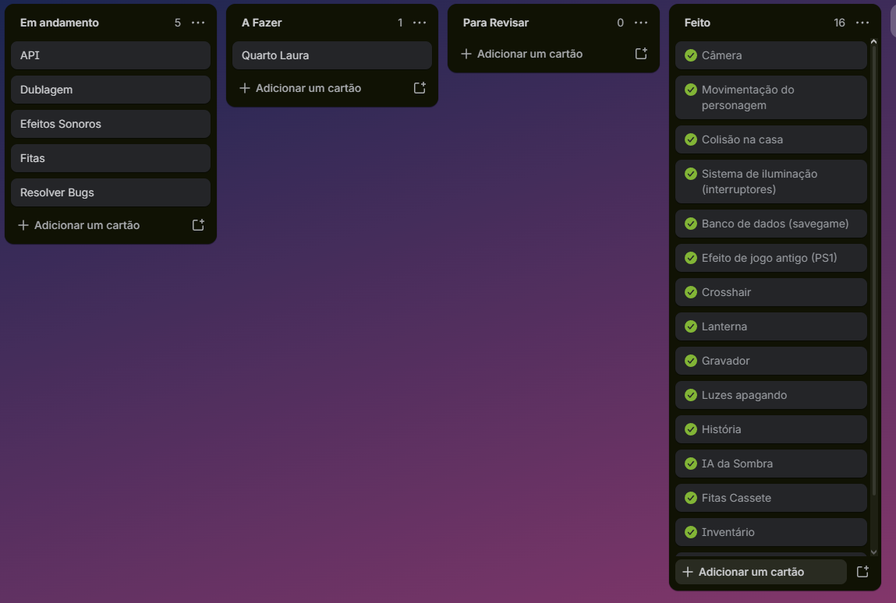
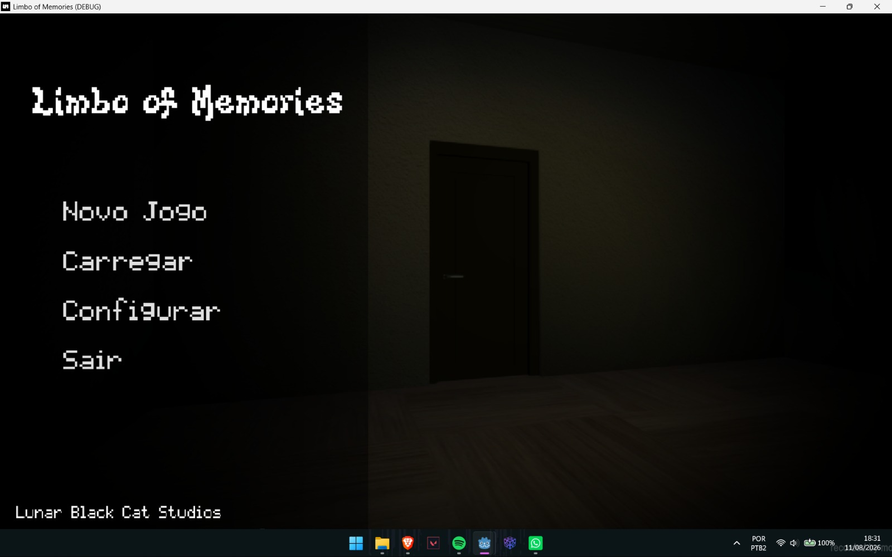
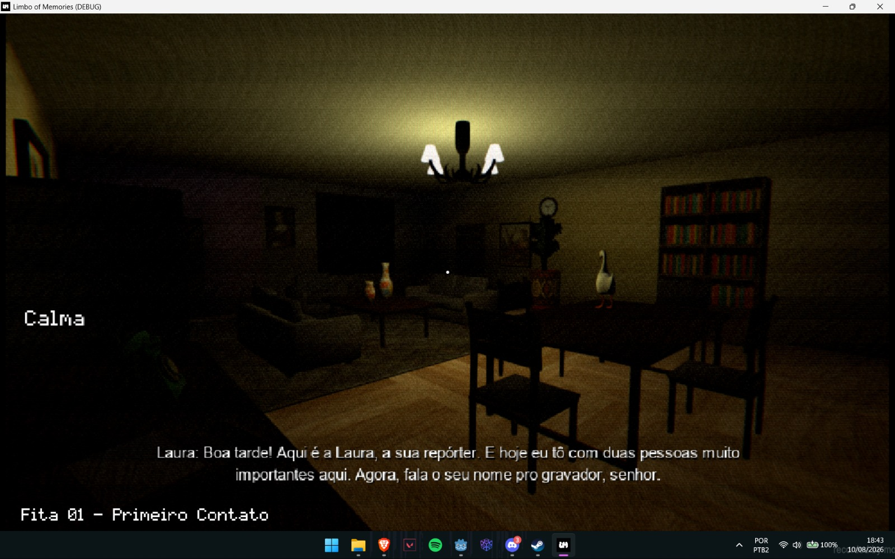
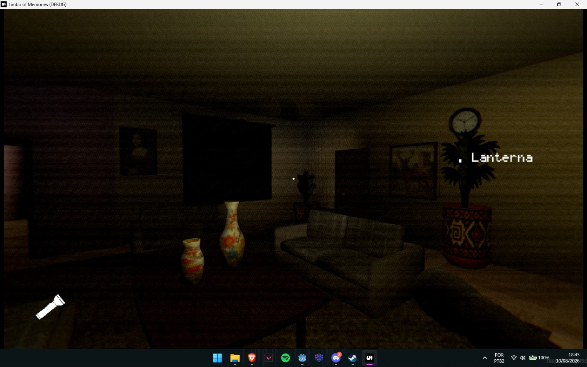
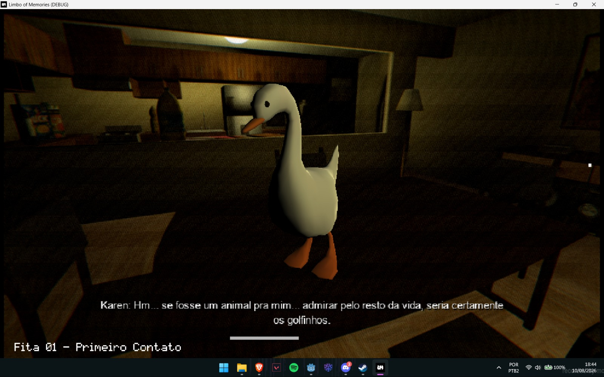

# Limbo of Memories

Jogo de terror psicológico em primeira pessoa, com estética PS1/low-poly, desenvolvido em **Godot Engine 3.6** como Trabalho de Conclusão de Curso.

> Anteriormente *Lost Memories* / *Lost Memories: Laura*.

**Estúdio:** Lunar Black Cat Studios
**Equipe de desenvolvimento:** Team Static Noise

A casa da protagonista representa suas memórias de infância. O foco temático do jogo está em culpa, luto, aceitação e traumas.

- **Gênero:** terror psicológico, exploração em primeira pessoa
- **Motor:** Godot Engine 3.6 (scripts em português)
- **Restrição de escopo:** não haverá modelos de personagens complexos, por questão de orçamento

---

## Índice

1. [Enredo e Narrativa](#enredo-e-narrativa)
2. [Gameplay](#gameplay)
3. [Sistema da Sombra](#sistema-da-sombra-a-sombra)
4. [Estados Emocionais da Laura](#estados-emocionais-da-laura)
5. [Fitas Cassete e Sr. Gravatinha](#fitas-cassete-e-sr-gravatinha)
6. [Sistema de Memórias](#sistema-de-memórias)
7. [Puzzles](#puzzles)
8. [Interface](#interface)
9. [Áudio](#áudio)
10. [Arte e Estética](#arte-e-estética)
11. [Tecnologia (Godot)](#tecnologia-godot)
12. [Estúdio e Equipe](#estúdio-e-equipe)
13. [Histórico de Versões](#histórico-de-versões)

---

## Enredo e Narrativa

### Premissa

Laura revive, em uma versão em limbo de sua casa de infância, memórias marcantes de sua vida — acessadas através de fitas cassete espalhadas pela casa.

### Espinha dorsal da história

- A doença terminal do pai, Jeff, é descoberta quando Laura tem entre 15 e 16 anos.
- O luto da mãe, Karen, se transforma em abuso psicológico após a morte de Jeff, ocorrida no aniversário de 18 anos de Laura.
- Karen culpa Laura pelas economias de aniversário não usadas no tratamento médico do pai.
- Laura sai de casa; há um episódio de overdose em um motel, com mensagens de despedida às amigas.
- **Final:** Laura sobrevive e acorda no hospital após enfrentar suas memórias (final único, sem final ruim).

### Personagens de apoio

| Personagem | Papel |
|---|---|
| Hannah | Vínculo protetor, quase de irmã mais velha |
| Ethan | Alívio cômico, personalidade caótica |
| Ryan | Descontraído, com momentos de profundidade |

> **Camada narrativa em avaliação** (ainda não confirmada): gravações de Jeff falando sobre o próprio pai, explorando ciclos geracionais e linguagens do amor.

---

## Gameplay

- Exploração em primeira pessoa
- Resolução de puzzles para avançar
- Coleta de fitas cassete que contam a história
- Leitura de cartas e bilhetes espalhados pela casa
- A casa muda conforme o jogador progride
- Inventário desliza pela direita (`Tab`); `Shift+Tab` mostra descrições dos itens

---

## Sistema da Sombra (A Sombra)

A Sombra representa a culpa de Laura. É praticamente estática, sem animações, e sua agressividade aumenta quanto menos fitas o jogador encontrou.

- Aparece perto do jogador, olhando para ele
- Se observada por cerca de 2 segundos, desaparece
- Se não observada, anda lentamente em direção ao jogador
- Pode aparecer muito rapidamente (cerca de 1,8 segundo)
- Nunca repete a mesma ação várias vezes seguidas

### Ações da Sombra

- Bater nas portas
- Apagar luzes
- Fazer a lanterna piscar
- Prender portas por cerca de 60 segundos
- Sussurrar
- Aumentar a tensão do jogador

---

## Estados Emocionais da Laura

Substituem a tradicional barra de vida.

| Estado | Emoji |
|---|---|
| Calma | 😐 |
| Insegura | 😟 |
| Assustada | 😨 |
| Em crise | 😭 |

Quando a tensão aumenta: mais estática na câmera, imagem mais escura e Sombra mais agressiva. Permanecer tempo demais em **"Em crise"** resulta em game over.

---

## Fitas Cassete e Sr. Gravatinha

### Fitas cassete

Principal forma de contar a história. O jogador usa um reprodutor de fita cassete. Está planejado um efeito de fita antiga sobre a voz das gravações. O pai de Laura (Jeff) tem várias falas gravadas.

### Sr. Gravatinha

Ursinho de pelúcia de Laura. Se teletransporta pela casa, conversa com ela e traz lembranças da infância. Vários diálogos dele já foram escritos. Funciona como contraponto temático à Sombra.

---

## Sistema de Memórias

O quarto de Laura começa praticamente vazio. Conforme itens importantes são encontrados, ele vai sendo preenchido, transmitindo a sensação de recuperação das lembranças.

---

## Puzzles

- Cartas
- Documentos
- Objetos escondidos
- Cifra de César, cadeados numéricos, desenhos de infância como chave de cifra

Puzzles simples, para não quebrar o ritmo da história.

---

## Interface

- Crosshair dinâmica
- Estados emocionais substituindo a barra de vida
- Menu em português
- Tela de loading com um ursinho

---

## Áudio

- Violão representando o pai
- Piano lento para momentos emocionais
- Respiração aumentando conforme a tensão
- Sons de estática quando Laura está assustada

Boa parte dos efeitos sonoros é controlada pela Godot.

---

## Arte e Estética

- Estética PS1/low-poly, com shader de pós-processamento (`overlay_ps1.shader`)
- Ícone do jogo: fita cassete, estética de quadrinho estilo Scott Pilgrim, contornos fortes, flat shading; logo monograma (LM)
- Menu principal com cenário de um cômodo da casa e animações de hover
- Tela de pickup de itens em 3D, estilo Resident Evil

---

## Tecnologia (Godot)

- Godot Engine 3.6; scripts em português
- Save automático só é ativado ao entrar em `casa_ofc.tscn`; autosave a cada minuto no slot escolhido pelo jogador
- Barra de loading tenta acompanhar o carregamento da cena
- Sistema de inspeção de objetos com pivot/rotação (`Camera.gd`)
- Migração para Godot 4 adiada, por conta do prazo do TCC

---

## Equipe

### Elenco de vozes

| Personagem | Dublador(a) |
|---|---|
| Jeff | Tadeu |
| Karen | Bruna |
| Laura criança | Emilly |
| Laura (depois dos 13 anos) | Mariane |
| Ethan | Matheus |
| Ryan | Luiz |
| Hannah | Eduarda |
| Sr. Gravatinha (ursinho) | Gabriel |

### Demais funções

| Nome | Função |
|---|---|
| Matheus | Game design, Trilha sonora e voz de Ethan |
| Luiz | Game design, API e voz de Ryan |
| Pedro G. | Game design e tarefas diego (kanban, trello...) |
| Pedro C. | Documentação e Atualização de telas (Figma) |
| Tadeu | Programação, direção, roteiro, API, modelagem 3D... |

---

## Histórico de Versões

- **v2.0** — versão anterior do documento
- **v3.0 (atual)** — inclusão do sistema da Sombra detalhado, estados emocionais, Sr. Gravatinha (nome e diálogos), sistema de memórias do quarto, puzzles, interface, áudio, detalhes técnicos da Godot, ajuste do desfecho da narrativa (Laura sobrevive) e elenco de vozes completo

---

## Kanban e indicadores

| Indicador | Valor |

| - - - - - - - - - - -| - - - - - - -|

| WIP ( limite ) | 5 cartões |

| Lead Time médio | 5,2 dias |

| Cycle Time médio | 3,4 dias |

## Metricas de validaçao
- **  Formuylario:** [ https://docs.google.com/forms/d/e/1FAIpQLSc2rx4NmC-VJyu3bjFEimku545Zvks5ccH1jGs1xIrx_KxeXA/viewform?usp=dialog ]
- ** Total de respostas : 6 
- ** Taxa de interesse : 100% disseram que usariam
- ** NPS Médio : 9,5
- ** Principais feedbacks : 
- Adicionaria mais história, mais itens, cartas, deixaria o game design melhor, colocaria mais tutoriais pro jogador saber o que precisa ser feito, adicionaria algo que desse vontade de jogar
- As IAs, tem muitos bugs, porta não abre depois de fechada, ursinho não aparece quando deve, a sombra fica te encarando e não some

## Roteiro do pitch
### Contexto
" Somos alunos do curso de Desenvolvimento de Sistemas e percebemos que neste cenário somos Laura, uma mulher que acorda perdida uma casa que parece familiar como se tivesse passado sua infância ali"
### Conflito
" O principal problema que queremos resolver ou tentar ajudar a lidar com isso é a ansiedade e depressão de pessoas que se encontram na situação da protagonista, tendo uma experiência onde ele descobre a história junto da protagonista e lida com suas emoções"
### Solução
" Para isso , criamos o jogo Lost Memories, que funciona da seguinte forma: uma mulher que descobre ao decorrer do jogo que teve muitos problemas com sua família, a enfermidade de seu pai e sua relação conturbada com sua mãe. E com isso lida de diferentes formas, tendo um final bom para esta situação"
### Prova
" Testamos com 6 jogadores e obtivemos uma média de nota de 9,5 e uma taxa de interesse de 100% entre os jogadores "
### Chamada para a ação 
Queremos que os jogadores sintam a história e entendam como Laura lidou com a situação

## Screenshots da aplicação
* Tela inicial do MVP *

* Tela de confirmaçãodo pedido *

https://github.com/user-attachments/assets/333666da-f511-48ba-9b61-aa1af3ba92c4
